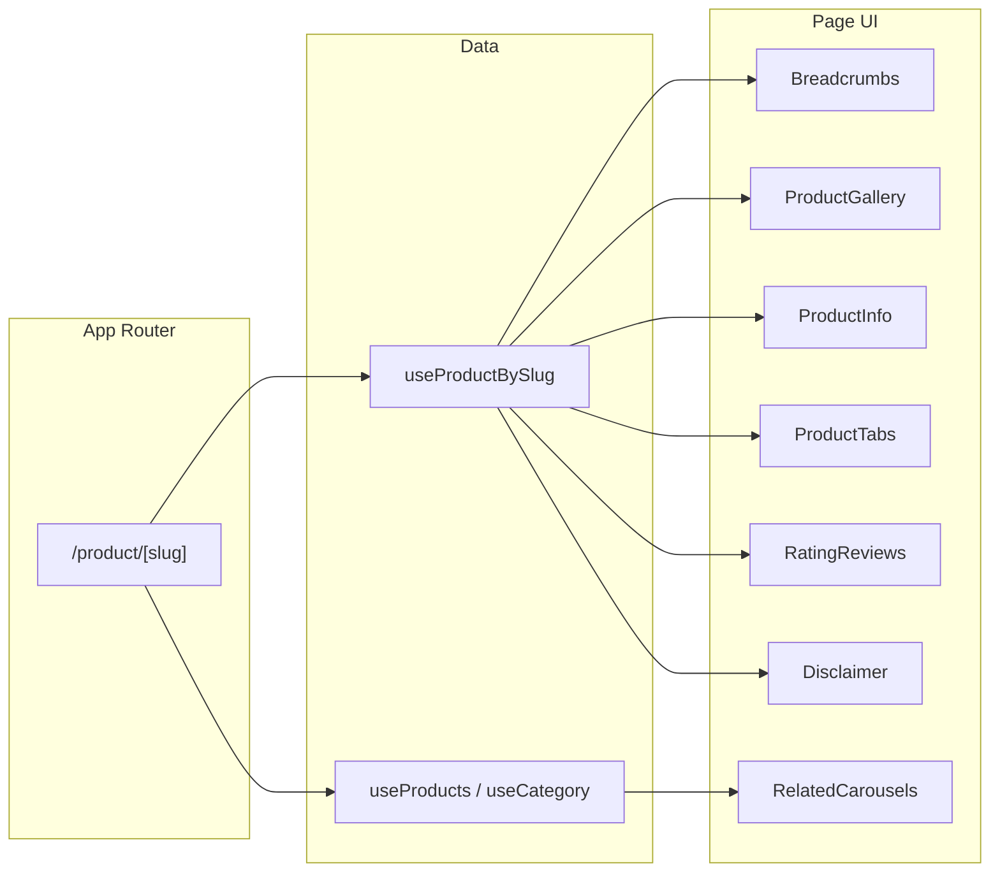

# Product Details Page Implementation

## Current state

- **Routing**: [ProductCard](src/components/common/ProductCard.tsx) already links to `/product/${product.slug}` but no route exists yet (404).
- **Data**: [useProducts](src/hooks/data/useProducts.ts) returns a flat list of products; no single-product or related-products API.
- **Types**: [Product](src/types/product.ts) has `id`, `name`, `slug`, `image`, `price`, `originalPrice`, `discountPercent`, `badge`, `rating`, `reviewCount`, `unit`, `categoryId` — no description, gallery, brand, or specification.
- **Layout**: Root [layout](src/app/layout.tsx) wraps with Navbar, CategoryBar, and DefaultLayout (sidebar + header + main). Product page will render inside DefaultLayout.
- **Reuse**: [CategoryProductSection](src/components/common/CategoryProductSection.tsx) uses Swiper + [ProductCard](src/components/common/ProductCard.tsx); Tabs and other UI components exist.

## Architecture

## 1. Route and data

- **Add dynamic route**: `src/app/product/[slug]/page.tsx`
  - Client page that reads `params.slug`, resolves product (and 404 if missing), then renders the full product-details layout.
- **Extend product data** for details page:
  - In [src/types/product.ts](src/types/product.ts): add optional `description?: string`, `images?: string[]`, `brand?: string`, `brandHref?: string`, `inStock?: boolean`, `deliveryText?: string`, `specification?: Record<string, string>` (or keep specification as string/HTML if preferred). Keep backward compatibility so existing list/card usage still works.
  - In [src/hooks/data/useProducts.ts](src/hooks/data/useProducts.ts):
    - Add `useProductBySlug(slug: string)`: return `Product | null` (e.g. `useProducts().find(p => p.slug === slug)` plus optional enrichment from a details map keyed by slug).
    - Optionally export a small helper `getRelatedProducts(product, useProducts())`: same category (e.g. same `categoryId`), limit 8–12; "More from brand" can use same list or a second mock list if `brand` is present; "Frequently Bought Together" and "Previously Viewed" can be fixed mock arrays of product ids/slugs resolved from the full list.
  - Enrich a subset of mock products (e.g. first 5–10) with `description`, `images`, `brand`, `deliveryText`, `specification` so the details page has real-looking content; others can fall back to single `image` and placeholder description.

## 2. Page structure (desktop vs mobile)

- **Breadcrumbs**: `Home > [Category title] > [Product name]`. Category title from [useCategory](src/hooks/data/useCategory.ts) via `product.categoryId`; link category to existing category URL pattern (e.g. `/category/[slug]`).
- **Hero block (two-column on desktop, single column on mobile)**:
  - **Left**: Image gallery — main image (large) + thumbnails. Desktop: thumbnails vertical beside main image. Mobile: main image full width, thumbnails as horizontal strip or dots below. Optional "Quick Look" overlay button. Reuse existing `image` and optional `images[]` (first item or `image` as main).
  - **Right**: Product info — title (H1), rating (stars + count, link to #reviews), brand line with optional link, price (current + strikethrough original + discount %), "In Stock" badge, quantity selector (- / number / +), primary "Add to Cart", secondary "Add to Wishlist", shipping/delivery note (e.g. "Free Shipping for orders over ₹500" / "12–24 HOURS" from `deliveryText`), social share icons.
- **Tabs**: Use [Tabs](src/components/ui/tabs.tsx). Two tabs: "Product Details" (default), "Specification". Content: Product Details = rich text description (and optional "Return Policy" link); Specification = key-value list or table from `specification`.
- **Rating & Reviews**: Overall score (e.g. 4.7/5), star bar breakdown (5→1), filter chips (All, With photos, 5 Star, 4 Star…), list of review cards (avatar, name, rating, text, date). Use mock array (e.g. 3–5 reviews) and optional pagination placeholder. Id for in-page link: `#reviews`.
- **Related sections**: Four horizontal carousels, each with section title and "See all" link where relevant:
  - Similar Products (same category, exclude current)
  - More From [Brand] (same brand if present, else hide or use same as similar)
  - Frequently Bought Together (mock list)
  - Previously Viewed (mock or localStorage-driven list)
    Use Swiper as in [CategoryProductSection](src/components/common/CategoryProductSection.tsx) (same breakpoints/slidesPerView) and reuse [ProductCard](src/components/common/ProductCard.tsx); wrap each section in a bordered/background block to match the design.
- **Disclaimer**: Small block with warning icon and body text; "Show more" to expand (optional collapsible).

## 3. Components to add

- `**src/app/product/[slug]/page.tsx**`: Client page; `useProductBySlug(slug)`, `notFound()` when null, then compose breadcrumbs + gallery + info + tabs + reviews + carousels + disclaimer. Use responsive grid (e.g. `grid-cols-1 lg:grid-cols-2` for hero) and existing spacing/typography.
- `**src/components/product/ProductGallery.tsx**`: Main image + thumbnail strip; state for selected index; desktop vertical thumbnails (left), mobile horizontal strip; aspect ratio for main image (e.g. 1:1 or 4/5).
- `**src/components/product/ProductInfo.tsx**`: Title, rating link, brand, price block, availability, quantity stepper, Add to Cart / Add to Wishlist, delivery note, share icons. Props: `product`, optional `onAddToCart`, `onWishlist` (no-op or wire to existing hooks later).
- `**src/components/product/ProductTabs.tsx**`: Tabs UI with "Product Details" and "Specification"; render `description` and `specification` from product.
- `**src/components/product/RatingReviews.tsx**`: Summary, bar chart, filters, review list (mock data passed as prop or hardcoded), optional pagination.
- `**src/components/product/RelatedProductsCarousel.tsx**`: Reusable section: title, "See all" href, `products` array; internal Swiper + ProductCard (same as CategoryProductSection). Use for Similar, More From Brand, FBT, Previously Viewed.
- `**src/components/product/Disclaimer.tsx**`: Icon + text + "Show more" expand. Content can be static or passed as prop.

Breadcrumbs can be a small inline component in the page or a shared [components/ui] breadcrumb if you already have one; otherwise a simple div with links is enough.

## 4. Responsive and UX

- **Desktop**: Max-width content area; gallery and info side by side; tabs and reviews full width; carousels full width with multiple visible slides (reuse CategoryProductSection breakpoints).
- **Mobile**: Stack gallery then info; full-width primary/secondary buttons; thumbnails horizontal below main image; carousels with 2 slides and swipe.
- **Accessibility**: Semantic headings (one H1 per page), alt on images, aria on quantity control and tabs. Skip link to #reviews from rating in ProductInfo.

## 5. Files to create or modify

| Action | File                                                                                |
| ------ | ----------------------------------------------------------------------------------- |
| Create | `src/app/product/[slug]/page.tsx`                                                   |
| Create | `src/components/product/ProductGallery.tsx`                                         |
| Create | `src/components/product/ProductInfo.tsx`                                            |
| Create | `src/components/product/ProductTabs.tsx`                                            |
| Create | `src/components/product/RatingReviews.tsx`                                          |
| Create | `src/components/product/RelatedProductsCarousel.tsx`                                |
| Create | `src/components/product/Disclaimer.tsx`                                             |
| Extend | `src/types/product.ts` (optional fields for details)                                |
| Extend | `src/hooks/data/useProducts.ts` (`useProductBySlug`, related helpers, mock details) |

No changes to DefaultLayout or Navbar are required unless you want a back button or wishlist icon on the product page only; the design can be implemented with the existing layout.

## 6. Optional follow-ups

- Connect "Add to Cart" / "Add to Wishlist" to [useCart](src/hooks/data/useCart.ts) / [useWishlist](src/hooks/useWishlist.tsx) if those hooks exist and are ready.
- Add `generateMetadata` in `page.tsx` for product title and description (SEO).
- "Previously Viewed" from localStorage (store slug on visit, read list and resolve via useProducts).
- Currency: ProductCard uses INR; if the app should show BDT (৳), switch formatting to BDT in one place or via a config/context.
